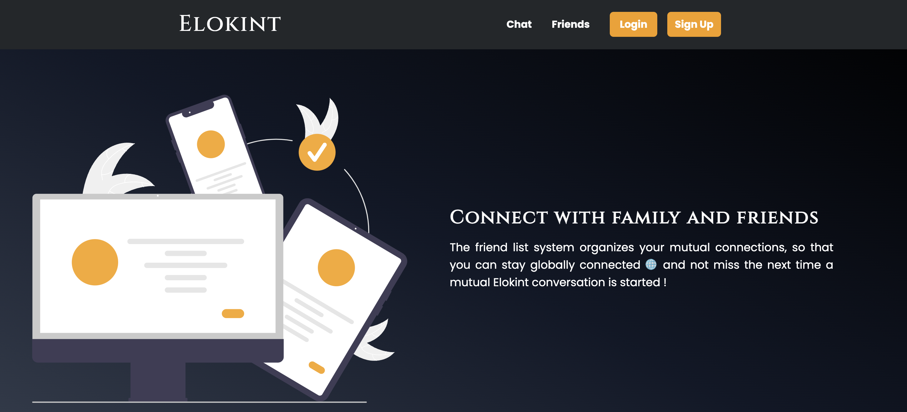
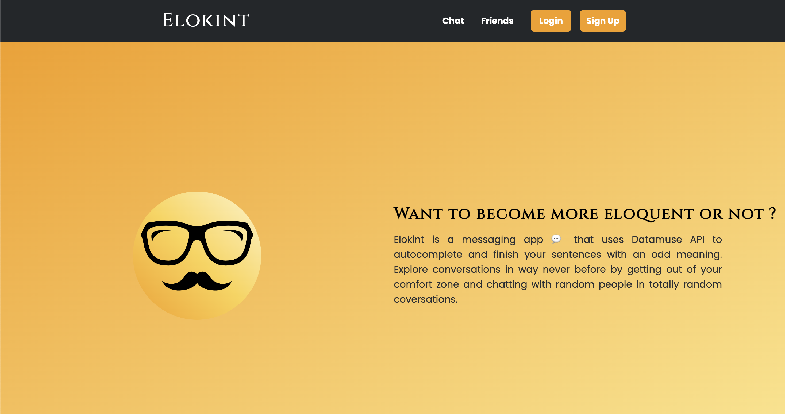

   
  <h1>🎙️ Elokint</h1>
  <strong>Messaging App with Random Autocomplete</strong>
   

## Description

Elokint is a messaging app with a twist, users have the option to switch into the "Elokint" mode which autocompletes their sentences using the Datamuse API to read the context of the words typed by the user and generate random word(s) to follow the sentence based on them.

